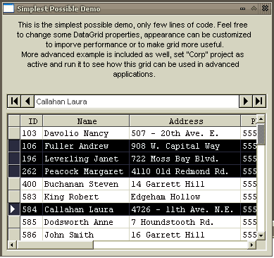



## Wolf DataGrid 1\.0\.0

### Description

If you hate Microsoft DataGrid and you dont need, cant find or dont have $300 for other grid then

you are gonna love this ;).

This is an activex control made in vb to replace bug-plagued DataGrid that you got with vs6. It

is pretty fast, supports many things that are left behind in MS DataGrid and it is open-source

(though not for proper distribution for now). Have a look at screenshots if there are some (psc

might not allow me to upload them).

There are some examples included on how to use the grid. It does not matter what drivers are used

since this grid uses t-sql for reading/writing data. For now it does not support built-in

editors, but that is to be added in next version. Just download the example and experiment a bit.

If you need any help on using the control post comment here and I will be glad to help.

This is first version, so please post any bugs you may find.
 
### More Info
 

             |
---                |---
**Submitted On**   |2005-01-12 20:19:04
**By**             |[TheAlas\.com](https://github.com/Planet-Source-Code/PSCIndex/blob/master/ByAuthor/thealas-com.md)
**Level**          |Intermediate
**User Rating**    |5.0 (139 globes from 28 users)
**Compatibility**  |VB 6\.0
**Category**       |[Databases/ Data Access/ DAO/ ADO](https://github.com/Planet-Source-Code/PSCIndex/blob/master/ByCategory/databases-data-access-dao-ado__1-6.md)
**World**          |[Visual Basic](https://github.com/Planet-Source-Code/PSCIndex/blob/master/ByWorld/visual-basic.md)
**Archive File**   |[Wolf\_DataG1839491132005\.zip](https://github.com/Planet-Source-Code/thealas-com-wolf-datagrid-1-0-0__1-58265/archive/master.zip)

